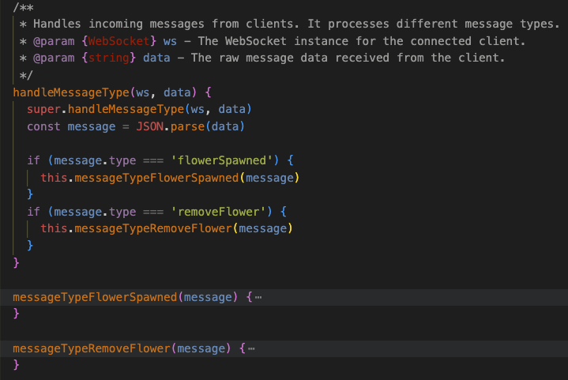
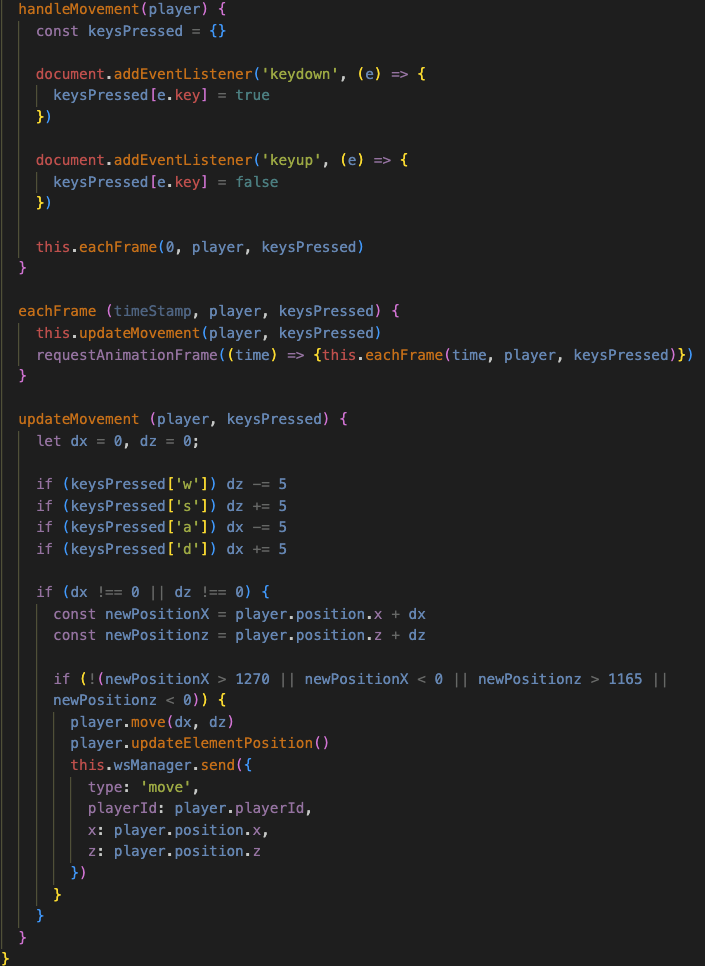
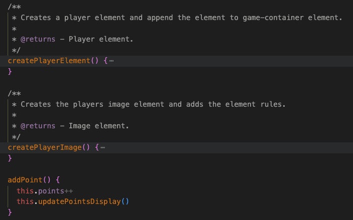
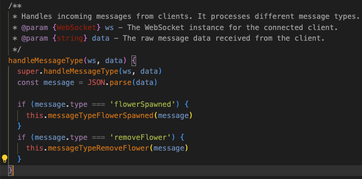
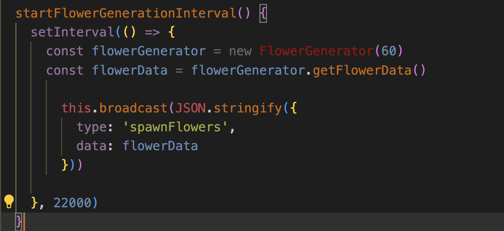
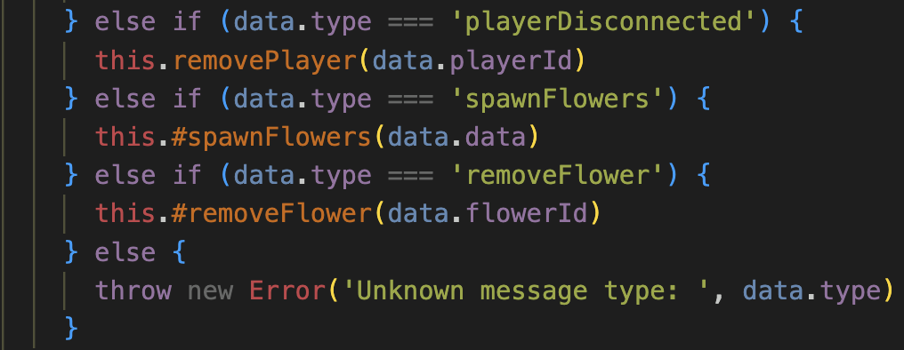
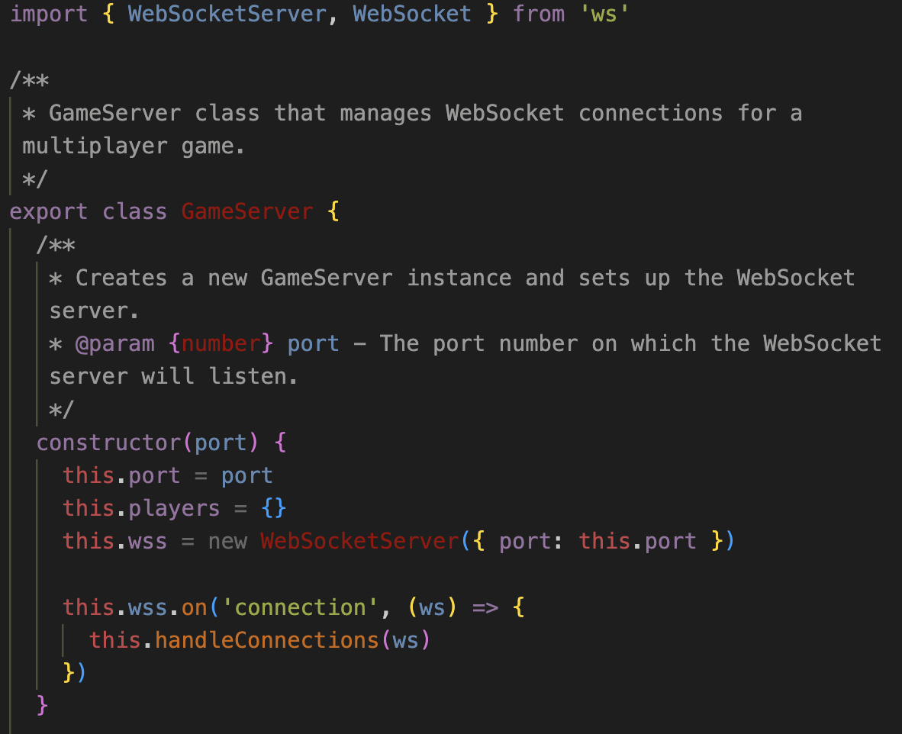
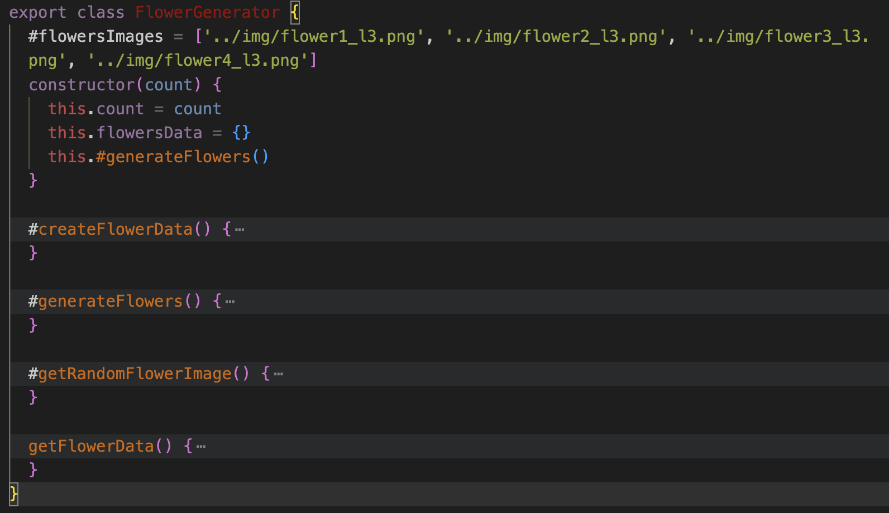
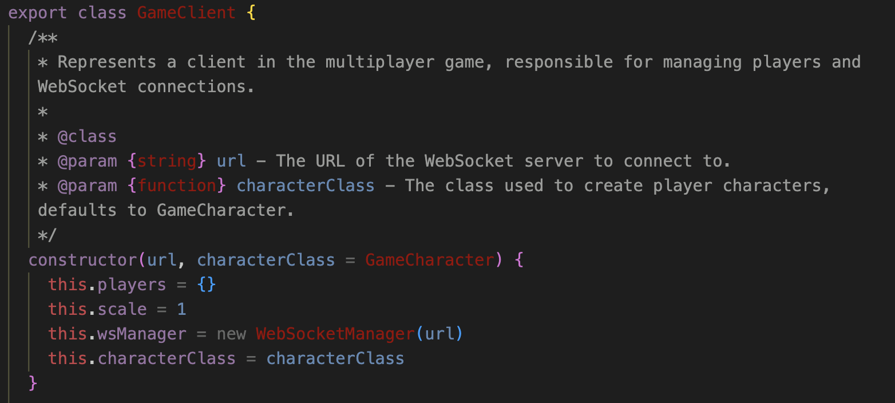

## Reflection

### Chapter 2

In the book, the author suggests using searchable names, which I find challenging to implement in a way that’s both descriptive and easily searchable. In my current code, the names I’ve used are quite descriptive, but they may not be very searchable.

As in this code snippet I think that I add meaningful context as both methods have a similar functionallity as they only handles different types of messages.

### Chapter 3

The function from the image shows the handleMovement witch was very long from the start. I have tried to break the method down but this is as small I was able to make it. I broke the method down to 3 methods instead of 1 witch made a big difference. The method updateMovement still has a lot of if-statements. I do think that the first 4 if-statements would be accepteble to have in one method and the other two would be seperated in to different methods.

### Chapter 4

I didn’t add a comment for addPoint() because, as the book mentions under “Mandated Comments,” it’s generally unnecessary for self-explanatory methods. In this snippet, the code specifies what happens locally. Chapter 4 discusses avoiding comments with nonlocal information, yet here I mention that playerElement is appended to game-container, which resides in the HTML document. Although this is technically nonlocal information, it directly reflects what the code is doing.

### Chapter 5

Properly formatted code is easier to read, understand, and debug. The book emphasizes that variable declarations should be placed as close to their usage as possible, which I agree with. This approach prevents the need to search through the code to locate where a variable is used. Clean code principles also highlight the importance of proper indentation. In my code snippet, the indentation ensures that the code is readable and its structure is clear. The book provides an example comparing code with and without indentation, clearly demonstrating how essential proper indentation is for readability.

### Chapter 6

Clean Code discusses “train wrecks” as a pattern where long chains of method calls reduce readability and increase coupling between classes. I have a clear example of this issue in my code: "const flowerData = flowerGenarator.getFlowerData()". Here, I’m using a method from another class, FlowerGenerator, to retrieve data within ExtendedGameServer. According to Clean Code, it’s best to avoid having direct method calls from FlowerGenerator within ExtendedGameServer to reduce dependency. However, I’m not entirely convinced by this rule—if classes and methods are kept readable and maintain clear responsibilities, then a well-organized chain of calls shouldn’t be an issue.

### Chapter 7

This snippet demonstrates my error handling for cases where the client receives an unknown message type from the server. When this occurs, the error message clearly indicates that it is an “unknown message type” and also displays the specific message type that does not match any of the expected cases. Following Clean Code’s principle of providing context with exceptions, I believe this error message supplies all the necessary context for easy debugging.

### Chapter 8

In Clean Code, chapter 8 discusses boundaries and the use of third-party code. In my code snippet, I’m using the “ws” package, but I’m only importing the specific components I need, and WebSocketServer is only used within this class. Following Clean Code principles, this approach keeps my code more maintainable and isolated from external dependencies, making it easier to manage any future updates or changes to the “ws” package.

### Chapter 9

[Test Specification](./TEST_SPECIFICATION.md)

While developing a simple game, I initially felt that manual testing was the most practical approach. I wasn’t entirely sure how to apply the concepts from this chapter, but the idea of “single concept per test” stood out as relevant. I decided to separate movement tests by key, testing each key individually, even though all keys ultimately trigger the same methods. This approach helped ensure clarity and focus in my tests.

### Chapter 10

As chapter 10 emphasizes, classes should remain small and focused on a single responsibility. This snippet exemplifies that principle, as the class is dedicated solely to generating and returning flowers, without any extraneous functionality. By adhering to this guideline, the code becomes more maintainable and easier to understand, allowing for better collaboration and future enhancements.

### Chapter 11

In my module, I implemented dependency injection by “injecting” a dependency from another class directly into my constructor. Other parts of this chapter also encouraged me to rethink my class structure. This was my first experience creating a game, and it was challenging. I’m not entirely happy with my code, as it feels somewhat messy. After reading the section “How Would You Build a City?”, I realized I could have separated responsibilities more effectively, which would likely lead to cleaner, more maintainable code.